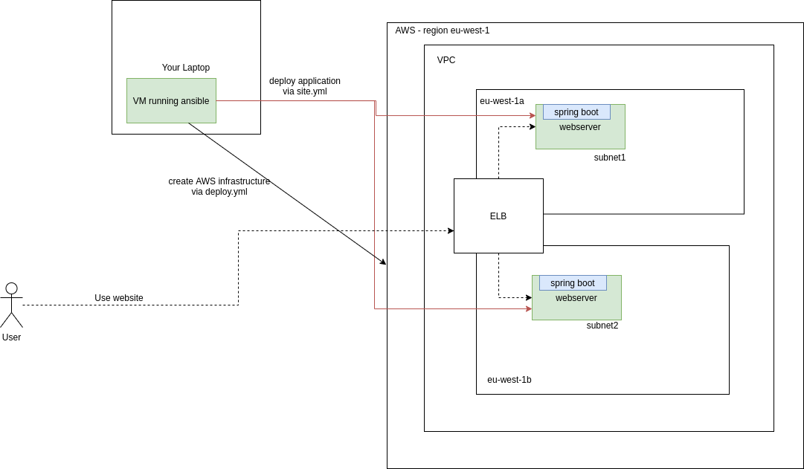

# ansible with amazon ec2 deployment

## Inventory setup
Based on [https://www.agix.com.au/build-an-ec2-using-ansible-step-by-step/](https://www.agix.com.au/build-an-ec2-using-ansible-step-by-step/)

This is the setup the scripts are going to create:


To create the aws instance first customize the vars in deploy.yml and then fill the aws credentials into the setupEnvironment.sh script
```
source setupEnvironment.sh
```
then potentially adjust the variables in deploy.yml to match your environment and run the deployment
```
ansible-playbook  -i ./hosts deploy.yml
```
it will add the IP to the ./hosts file to be able to use this in the follow on commands

To install stuff simply run:
```
ansible-playbook  -i ./hosts site.yml --key-file ansibleDemo.pem
```

